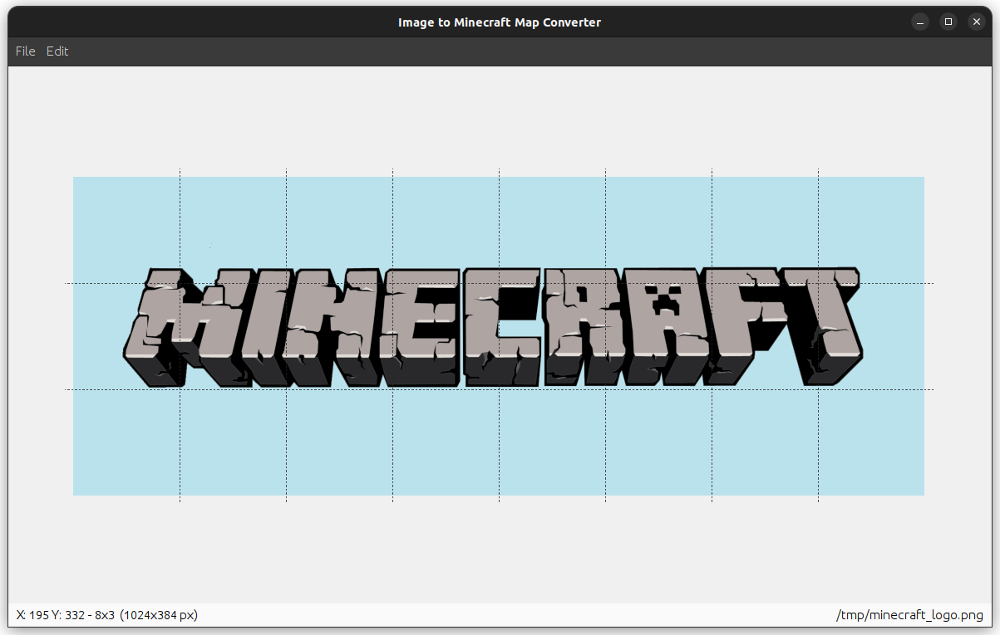

# ImageToMinecraftMap
This utility program allows you to convert images easily (PNG, JPEG) to minecraft maps.



## Color palette

Supported color palette: `1.17+` \
Data version: `2724 (1.17)`

## Launch4j
This tool uses `Launch4j` to pack the application into a self executable binary (for example .exe files for Windows).

[Website](http://launch4j.sourceforge.net/)


## Building

Requires Apache Maven 3.6 or later and Java 11 or later. Build using the following command: 

```bash
$ mvn clean package
```

Output directory of binaries is `target`. CLI und GUI versions are currently different JAR files (because different Main Class).
The Windows Executable only include the GUI version.

## ToDo

- [ ] Support multiple minecraft versions
- [ ] Extend imag editor features: Scaling, Resizing, Transformations
- [ ] Implement action history (undo, redo)

## License

This project is licensed under the [General Public License V3](https://www.gnu.org/licenses/gpl-3.0.en.html) (GPLv3).
See file [LICENSE](/LICENSE).